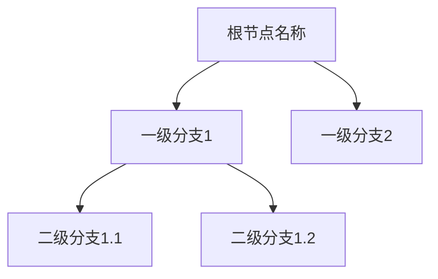
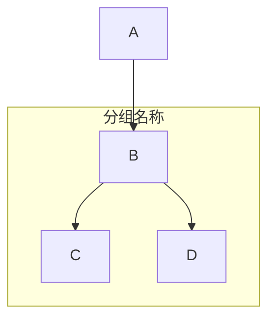

# \*\*深度学习的核心领域及对比分析\*\*

【文章摘要转思维导图 Mermaid 代码生成提示词】

请根据用户提供的**文章摘要内容**，分析其核心结构和逻辑关系，生成对应的**Mermaid 思维导图代码**（使用`graph`语法，优先选择`TD`从上到下布局）。具体要求如下：

#### **一、内容处理规则**

**提取核心主题**

首先确定摘要的**中心主题**，作为思维导图的**根节点**（主标题），用**加粗字体**标注。

示例：若摘要围绕 “人工智能发展历程”，根节点为`**人工智能发展历程**`。

**拆解一级分支**

按逻辑层次拆分摘要中的**主要章节、论点或模块**，作为根节点的**一级分支**（子节点）。

每个分支需概括一个独立的核心内容，避免重复或交叉。

**补充二级 / 三级细节**

对每个一级分支下的**关键论据、案例、数据或细分点**，进一步拆解为二级 / 三级子节点。

若存在并列关系（如多个案例），用无序列表符号（`-`）表示；若存在顺序关系（如时间线），用有序列表符号（`1.` `2.`）。

**标注特殊关系**

若节点间存在**因果关系、对比关系或引用关系**，用箭头（`->`）或注释（`%%`）标注。

示例：`A --> B %% A是B的原因`。

#### **二、Mermaid 代码格式要求**

**基础结构**

**节点命名规范**

节点名称需**简洁明了**，使用**短语或关键词**（避免长句）。

重要概念或数据可加**引号**强调，如：`"2023年增长率达15%"`。

**布局优化**

优先使用`TD`（从上到下）布局，若内容适合横向扩展，可改用`LR`（从左到右）。

复杂分支可通过`subgraph`分组，提升可读性：

#### **三、示例参考**

**输入摘要**：“本文提出了面向边缘设备的域自适应联邦学习框架 DapperFL，其通过Model Fusion Pruning（MFP）模块利用本地和其他域的融合知识对本地模型进行个性化剪枝，生成紧凑模型以应对系统异构性，同时借助Domain Adaptive Regularization（DAR）模块引入正则化项促使编码器学习域不变表示，缓解域偏移问题，并设计了适用于异构模型的聚合算法。实验表明，DapperFL 在 Digits 和 Office Caltech 数据集上较先进框架精度提升最高 2.28%，模型体积减少 20%-80%，代码已开源。”

**生成代码**：

## **研究背景**
- 联邦学习在边缘计算中面临系统异构性和域偏移问题
- 现有框架多独立解决单一挑战，缺乏同时应对两者的方案
## **核心模块**
- Model Fusion Pruning (MFP)
  - 融合全局与本地模型知识生成剪枝掩码
  - 动态调整融合因子α^t^平衡域知识
  - 采用通道级L1范数实现结构剪枝
- Domain Adaptive Regularization (DAR)
  - 将模型分割为编码器与分类器
  - 通过L2正则化促使编码器学习域不变表示
  - 结合交叉熵损失构建本地优化目标
## **异构聚合算法**
- 利用全局模型恢复剪枝模型结构
- 结合本地知识与全局知识进行加权聚合
- 公式：W^t^=∑(|D_i|/|D|)w_i^t^
## **实验结果**
- 数据集：Digits（MNIST/USPS/SVHN/SYN）、Office Caltech
- 性能：全局精度较SOTA提升0.13%-2.28%
- 模型压缩：参数减少20%-80%，FLOPs同步降低
- 消融实验：MFP和DAR模块协同提升性能
## **贡献总结**
- 提出MFP和DAR模块解决异构性与域偏移
- 设计异构模型聚合算法
- 实验验证精度与压缩效率优势