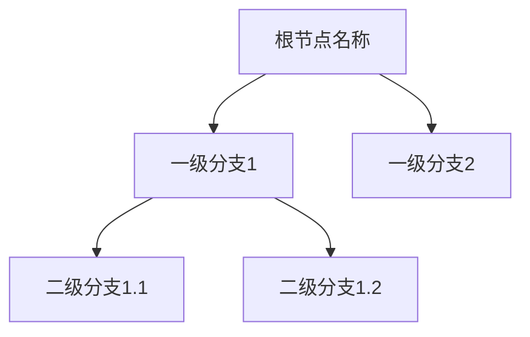
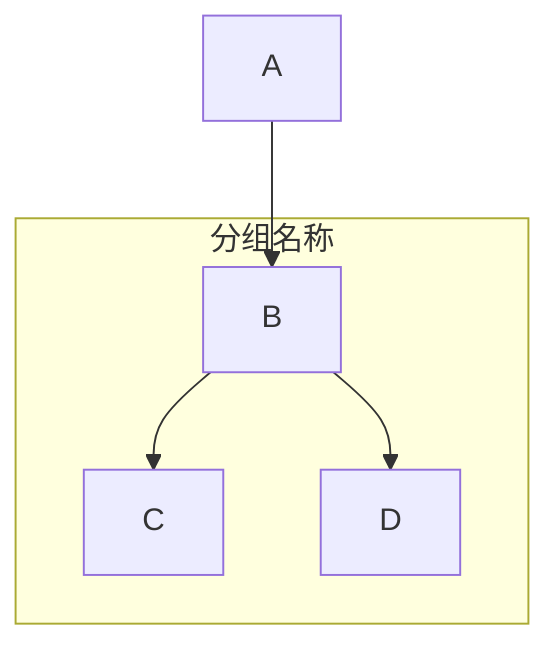

# \*\*深度学习的核心领域及对比分析\*\*

【文章摘要转思维导图 Mermaid 代码生成提示词】

请根据用户提供的**文章摘要内容**，分析其核心结构和逻辑关系，生成对应的**Mermaid 思维导图代码**（使用`graph`语法，优先选择`TD`从上到下布局）。具体要求如下：

#### **一、内容处理规则**

**提取核心主题**

首先确定摘要的**中心主题**，作为思维导图的**根节点**（主标题），用**加粗字体**标注。

示例：若摘要围绕 “人工智能发展历程”，根节点为`**人工智能发展历程**`。

**拆解一级分支**

按逻辑层次拆分摘要中的**主要章节、论点或模块**，作为根节点的**一级分支**（子节点）。

每个分支需概括一个独立的核心内容，避免重复或交叉。

**补充二级 / 三级细节**

对每个一级分支下的**关键论据、案例、数据或细分点**，进一步拆解为二级 / 三级子节点。

若存在并列关系（如多个案例），用无序列表符号（`-`）表示；若存在顺序关系（如时间线），用有序列表符号（`1.` `2.`）。

**标注特殊关系**

若节点间存在**因果关系、对比关系或引用关系**，用箭头（`->`）或注释（`%%`）标注。

示例：`A --> B %% A是B的原因`。

#### **二、Mermaid 代码格式要求**

**基础结构**




**节点命名规范**

节点名称需**简洁明了**，使用**短语或关键词**（避免长句）。

重要概念或数据可加**引号**强调，如：`"2023年增长率达15%"`。

**布局优化**

优先使用`TD`（从上到下）布局，若内容适合横向扩展，可改用`LR`（从左到右）。

复杂分支可通过`subgraph`分组，提升可读性：




#### **三、示例参考**

**输入摘要**：“本文主要介绍深度学习的三大核心领域：卷积神经网络（CNN）、循环神经网络（RNN）和生成对抗网络（GAN）。CNN 常用于图像识别，通过卷积层和池化层提取特征；RNN 适用于序列数据，如自然语言处理，具有记忆单元；GAN 由生成器和判别器组成，用于生成逼真数据。此外，文章对比了三者的应用场景和性能差异。”

**生成代码**：


```mermaid
graph TD
  **深度学习核心领域** --> "卷积神经网络（CNN）"
  **深度学习核心领域** --> "循环神经网络（RNN）"
  **深度学习核心领域** --> "生成对抗网络（GAN）"
  "卷积神经网络（CNN）" --> "- 图像识别"
  "卷积神经网络（CNN）" --> "- 卷积层+池化层提取特征"
  "循环神经网络（RNN）" --> "- 序列数据（如NLP）"
  "循环神经网络（RNN）" --> "- 记忆单元"
  "生成对抗网络（GAN）" --> "- 生成器+判别器架构"
  "生成对抗网络（GAN）" --> "- 生成逼真数据"
  %% 对比关系
  "卷积神经网络（CNN）" -->|"应用场景/性能"| 对比分析
  "循环神经网络（RNN）" -->|"应用场景/性能"| 对比分析
  "生成对抗网络（GAN）" -->|"应用场景/性能"| 对比分析
```

####